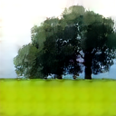
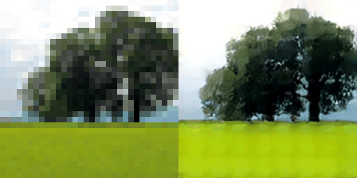

# SeedVR2-ncnn

Native C++ / ncnn / Vulkan image and video enhancement CLI for SeedVR2 on Linux and Windows x86_64.

[Runtime downloads](https://github.com/HGinkgo/SeedVR2-ncnn/releases/latest) | [Model download](https://modelscope.cn/models/HGinkgo/SeedVR2-ncnn) | [Chinese](README.md)

## Showcase

The following result was generated by the current `main` Vulkan CLI on GPU 0 of an RTX 3090. The left image is the input and the right image is the output; the example uses a `32x32` input and an explicit `128x128` target.

| Input | Output |
| --- | --- |
|  |  |

Two-frame AVI example (input left, output right):



The source photograph comes from [ArrayFire assets](https://github.com/arrayfire/assets/blob/master/examples/images/README.md) and is released under CC0 1.0. The committed demo assets contain only its `32x32` crop and this project's generated results.

## What It Does

- Runs the FP32 SeedVR2 model with Vulkan GPU acceleration, without Python, PyTorch, or CUDA.
- Processes PNG/JPEG images and RGB24 AVI video. The Linux and Windows runtime packages include LGPL FFmpeg runtime libraries for common compressed video inputs; video output is always RGB24 AVI.
- Plans an output size automatically from the input or accepts an explicit `--width` and `--height`.
- Handles one image, up to two images in one invocation, or one video file.
- Standard output applies reference-guided color reconstruction, retaining generated high-frequency detail while reconstructing low-frequency color from the input.

## Quick Start

1. Download and extract the appropriate runtime package from [Releases](https://github.com/HGinkgo/SeedVR2-ncnn/releases/latest).
2. Download the model from [ModelScope](https://modelscope.cn/models/HGinkgo/SeedVR2-ncnn) into the runtime directory. With the ModelScope CLI installed:

```bash
modelscope download HGinkgo/SeedVR2-ncnn --local-dir models/seedvr2-3b
```

3. Run an image on Linux:

```bash
./seedvr2-ncnn \
  --model-dir models/seedvr2-3b \
  --input input.png \
  --output output.png \
  --gpu-id 0
```

Use the same arguments from the Windows runtime directory:

```bat
seedvr2-ncnn.bat --model-dir models\seedvr2-3b --input input.png --output output.png --gpu-id 0
```

Process a video at an explicit low-resolution target:

```bash
./seedvr2-ncnn \
  --model-dir models/seedvr2-3b \
  --input input.avi \
  --output output.avi \
  --width 128 --height 128 \
  --gpu-id 0
```

Use `--help` for all options. Model weights are distributed separately; the runtime itself has no Python, PyTorch, or CUDA dependency.

Output postprocessing retains generated high-frequency detail while reconstructing low-frequency color from an input reference. Video mode spools reference frames to a process-local temporary file instead of retaining the whole clip in memory.

## Dynamic Resolution

Automatic mode preserves the input aspect ratio, aligns the target to 16 pixels, and center-crops when necessary. Target area is capped at `256x256`; inputs already below that cap are not enlarged merely to fill it. Explicit `--width` / `--height` values use the same cap.

| Release-validated target | Image | Two-frame AVI |
| --- | --- | --- |
| `128x128` | Verified | Verified |
| `128x256` | Verified | - |
| `256x256` | Verified | - |

Other dynamic sizes that meet the 16-pixel alignment and area limit can be requested, but are outside the current release validation promise.

## Inputs and Outputs

| Workflow | Input | Output |
| --- | --- | --- |
| Images | PNG, JPEG | PNG, JPEG |
| Base video path | RGB24 AVI | RGB24 AVI |
| Runtime with FFmpeg | Common compressed video formats | RGB24 AVI |

Repeat `--input` and `--output` once each to process two images in one invocation. Video input requires exactly one input and one `.avi` output.

## Model and Hardware

`--model-dir` must point to the complete dynamic package published on ModelScope: the directory contains `manifest.sha256` with 75 records and no symbolic links.

The current model is FP32 and normally needs roughly 10 GiB or more of Vulkan heap. An RTX 3090 is the low-resolution acceptance baseline; 6 GiB-class GPUs are outside the end-to-end support target. The Linux x86_64 runtime uses Ubuntu 22.04 (glibc 2.35) as its compatibility baseline. Windows GPU drivers are supplied by the operating system.

## Current Boundaries

- This release line targets low-resolution output; 720p and long video are not supported or validated yet.
- macOS is out of scope.
- Model weights and third-party dependencies remain under their respective licenses.

## Build From Source

The CPU build needs CMake and a C++17 compiler:

```bash
cmake -S . -B build -DSEEDVR2_ENABLE_VULKAN=OFF -DCMAKE_BUILD_TYPE=Release
cmake --build build --parallel
```

The Vulkan build needs a local Vulkan SDK, Vulkan-capable GPU, and compatible driver:

```bash
cmake -S . -B build-vulkan -DSEEDVR2_ENABLE_VULKAN=ON -DCMAKE_BUILD_TYPE=Release
cmake --build build-vulkan --parallel
```

For compressed video input, also configure `-DSEEDVR2_ENABLE_FFMPEG=ON` and provide FFmpeg development libraries.

## Development and Tests

Default CTest covers the fast native unit and backend-contract checks. Model-backed graph-load, golden, and end-to-end tests require local models and reference data and are opt-in. See [tests/README.md](tests/README.md) for the test tiers.

```bash
cmake -S . -B build -DSEEDVR2_ENABLE_VULKAN=OFF -DSEEDVR2_BUILD_TESTS=ON
cmake --build build --parallel 2
ctest --test-dir build --output-on-failure
```

## License

ncnn uses the BSD-3-Clause license. SeedVR2 models, weights, and other third-party dependencies are subject to their respective licenses.
