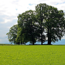
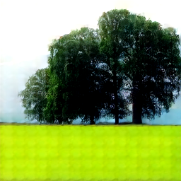
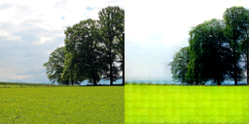

# SeedVR2-ncnn

适用于 Linux 和 Windows x86_64 的 SeedVR2 原生 C++ / ncnn / Vulkan 图像与视频增强命令行工具。

[下载运行包](https://github.com/HGinkgo/SeedVR2-ncnn/releases/latest) | [下载模型](https://modelscope.cn/models/HGinkgo/SeedVR2-ncnn) | [English](README.en.md)

## 效果展示

下列结果由当前 `main` 的 Vulkan CLI 在 RTX 3090 的 GPU 0 上实际生成。图像和视频分别展示本项目支持的两类工作流；当前发布线的最大目标为 `256x256`。

### 图像增强

左图为 `128x128` 输入，右图为显式 `256x256` 目标的实际输出。

| 输入 | 输出 |
| --- | --- |
|  |  |

### 视频增强

下面是同一连续序列的输入与实际 `256x256` 输出对照。输入与输出 AVI 均为连续 3 秒、36 帧、12 fps；GIF 仅作逐帧并排预览（左：放大的 `128x128` 输入；右：输出）：



示例源图来自 [ArrayFire assets](https://github.com/arrayfire/assets/blob/master/examples/images/README.md)，以 CC0 1.0 发布。视频输入是由该实景图生成的连续平移镜头；提交的展示资产仅包含输入裁剪及本项目实际生成的图像/视频结果。

## 能做什么

- 使用 Vulkan GPU 运行 FP32 SeedVR2 模型，无需 Python、PyTorch 或 CUDA。
- 处理 PNG/JPEG 图片；处理 RGB24 AVI 视频。Linux/Windows 运行包带有 LGPL FFmpeg 运行时，可读取常见压缩视频输入；视频输出固定为 RGB24 AVI。
- 根据输入自动规划目标尺寸，或使用 `--width` 和 `--height` 指定目标尺寸。
- 支持单张图片、最多两张图片的一次调用，以及单个视频文件。
- 不提供文生图、文生视频或图生视频生成工作流；输入内容保持为图片或视频增强任务。

## 快速开始

1. 从 [Releases](https://github.com/HGinkgo/SeedVR2-ncnn/releases/latest) 下载并解压对应平台的运行包。
2. 从 [ModelScope](https://modelscope.cn/models/HGinkgo/SeedVR2-ncnn) 下载模型到运行包目录。安装了 ModelScope CLI 时可执行：

```bash
modelscope download HGinkgo/SeedVR2-ncnn --local-dir models/seedvr2-3b
```

3. 在 Linux 运行第一张图片：

```bash
./seedvr2-ncnn \
  --model-dir models/seedvr2-3b \
  --input input.png \
  --output output.png \
  --gpu-id 0
```

Windows 在运行包目录中使用同样的参数：

```bat
seedvr2-ncnn.bat --model-dir models\seedvr2-3b --input input.png --output output.png --gpu-id 0
```

将视频处理到指定的低分辨率目标：

```bash
./seedvr2-ncnn \
  --model-dir models/seedvr2-3b \
  --input input.avi \
  --output output.avi \
  --width 128 --height 128 \
  --gpu-id 0
```

使用 `--help` 查看全部参数。模型包独立分发；运行包本身不依赖 Python、PyTorch 或 CUDA。

## 动态尺寸

发布版的自动模式保持输入宽高比，将目标对齐到 16 像素，并在必要时居中裁剪。目标面积不超过 `256x256`；低于该上限的输入不会仅为填满面积而被放大。显式 `--width` / `--height` 使用相同上限。

| 发布验证目标 | 图片 | AVI |
| --- | --- | --- |
| `128x128` | 已验证 | 已验证（两帧） |
| `128x256` | 已验证 | - |
| `256x256` | 已验证 | 已验证（连续 36 帧） |

其他符合 16 像素对齐和面积上限的动态尺寸可以请求，但不属于当前发布验证承诺。

## 输入与输出

| 工作流 | 输入 | 输出 |
| --- | --- | --- |
| 图片 | PNG、JPEG | PNG、JPEG |
| 基础视频 | RGB24 AVI | RGB24 AVI |
| 带 FFmpeg 的运行包 | 常见压缩视频格式 | RGB24 AVI |

图片调用可将 `--input` 和 `--output` 各重复一次，以在一次调用中处理两张图片。视频调用要求一个输入和一个 `.avi` 输出。

## 模型与硬件

模型目录必须是 ModelScope 发布的完整动态包：根目录含有 `manifest.sha256`（75 条记录），且包内不能有符号链接。将该目录传给 `--model-dir`。

当前模型为 FP32，通常需要约 10 GiB 或以上的 Vulkan heap。RTX 3090 是低分辨率路径的验收基线；6 GiB 级显卡不在端到端支持范围内。Linux x86_64 运行包以 Ubuntu 22.04（glibc 2.35）为兼容基线构建，Windows GPU 驱动需由系统自行提供。

## 当前边界

- 本发布线面向低分辨率目标；720p 与长视频尚未纳入支持或验证范围。
- macOS 不在产品范围内。
- 模型权重和第三方依赖遵循各自许可证。

## 从源码构建

CPU 构建只需要 CMake 和 C++17 编译器：

```bash
cmake -S . -B build -DSEEDVR2_ENABLE_VULKAN=OFF -DCMAKE_BUILD_TYPE=Release
cmake --build build --parallel
```

Vulkan 构建需要本地 Vulkan SDK、支持 Vulkan 的 GPU 与驱动：

```bash
cmake -S . -B build-vulkan -DSEEDVR2_ENABLE_VULKAN=ON -DCMAKE_BUILD_TYPE=Release
cmake --build build-vulkan --parallel
```

压缩视频输入还需要在配置时加入 `-DSEEDVR2_ENABLE_FFMPEG=ON` 并提供 FFmpeg 开发库。

## 开发与测试

默认 CTest 覆盖快速的原生单元和后端契约测试；模型加载、golden 和端到端测试需要本地模型及参考数据，按需启用。测试层级见 [tests/README.md](tests/README.md)。

```bash
cmake -S . -B build -DSEEDVR2_ENABLE_VULKAN=OFF -DSEEDVR2_BUILD_TESTS=ON
cmake --build build --parallel 2
ctest --test-dir build --output-on-failure
```

## 许可证

ncnn 使用 BSD-3-Clause 许可证。SeedVR2 模型、权重和其他第三方依赖遵循各自许可证。
